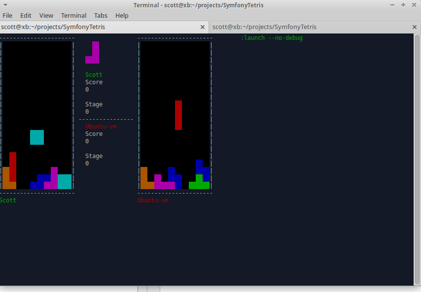

Symfony Multiplayer Tetris
==========================

Tetris in a Symfony Console Application

### Installation

Clone project, run `composer install`.

Launch application with `app/console tetris:launch --no-debug`.

Select the default `parameters.yml` options during composer install.

### Gameplay

Single or Multiplayer!

Clear multiple lines to add lines to your opponents board. For every line (over one) that you clear, you will add that many random lines to the bottom of your opponents board.
